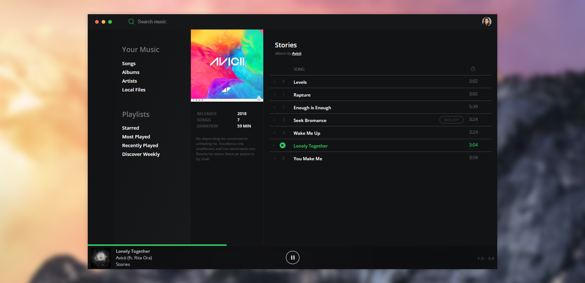

### Introduction

The music player showcases an album with its list of songs inspired by spotify. It uses Youtube IFrame to play and control the player and its songs. It takes the Youtube Video ID and plays it in the IFrame without showing the IFrame. The IFrame is then controlled using the Player Component, giving it more "music app" like feel.

### Technologies
* React & Redux
* Aphrodite - Styling
* YouTube IFrame API

### Installation
To run locally, clone the repo, run yarn install to install the needed depencies, and yarn start to start the local server.
