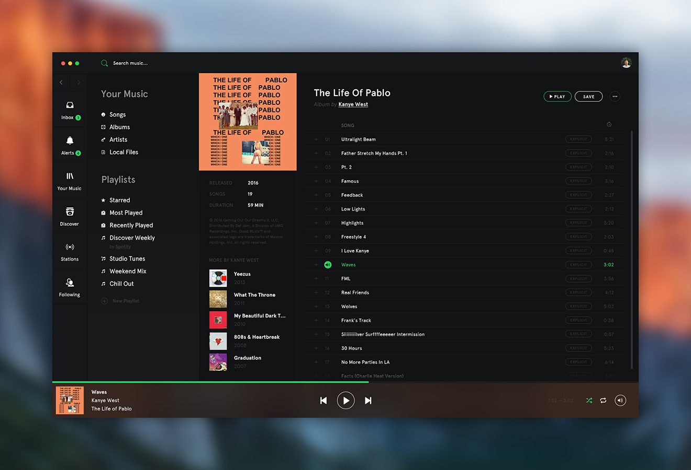

### Introduction

The design was by Max Axell on Dribbble.

This personal project is currently a work in progress. It is a Music Player App being built in React & Redux. The idea is that it will be able to play youtube videos through its iFrame. The IFrame won't be shown but the user will be presented with a music player component with the controls that will control the functions such as pause and play. 

### Technologies
React & Redux
Aphrodite - Styling
